# Python Lists: Unpacking and Slicing

## Table of Contents
- [Python's Built-in Functions for Lists](#pythons-built-in-functions-for-lists)
- [List Unpacking](#list-unpacking)
- [Negative Indexing](#negative-indexing)
- [List Slicing](#list-slicing)
- [Common Slicing Patterns](#common-slicing-patterns)
- [Practice Problems](#practice-problems)

---

## Python's Built-in Functions for Lists

Python has many built-in functions that work with lists. Here are some of the most useful ones:

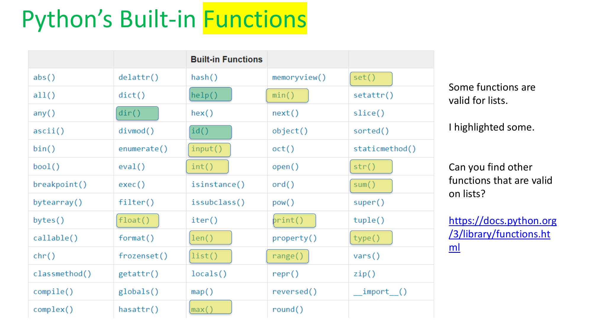

### Important Functions for Lists:
- `len()` - Get the length of a list
- `min()` - Find the minimum value
- `max()` - Find the maximum value
- `sum()` - Add up all the numbers
- `sorted()` - Return a sorted copy of the list
- `list()` - Convert something to a list
- `type()` - Check what type something is

### Getting Help in Python

You can ask Python for help anytime!

```python
# What methods are available for lists?
dir(list)
help(list)

# Learn more about a specific method
help(list.remove)
```

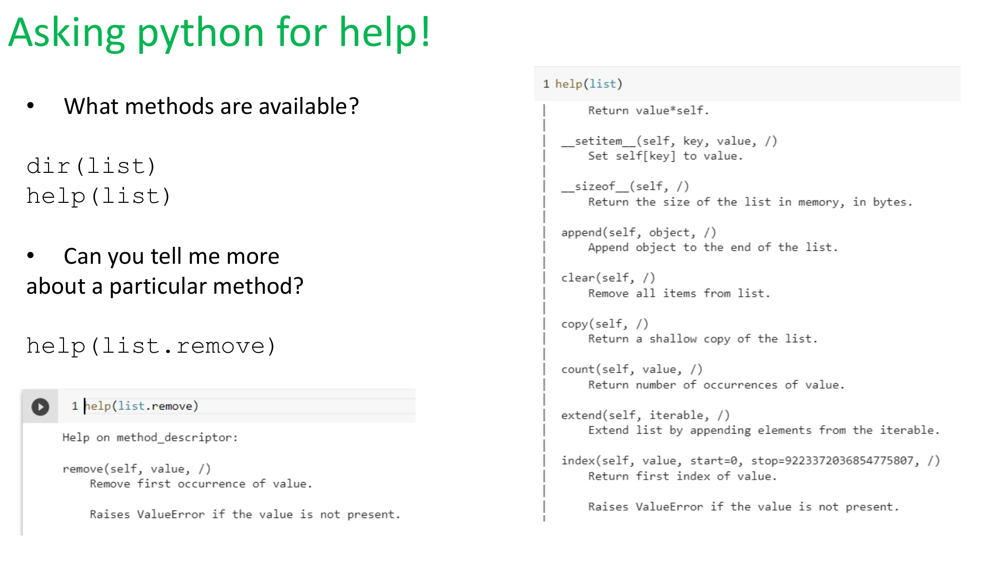

---

## List Unpacking

### What is List Unpacking?

List unpacking is a shorthand way to assign list values to multiple variables **in a single line**!

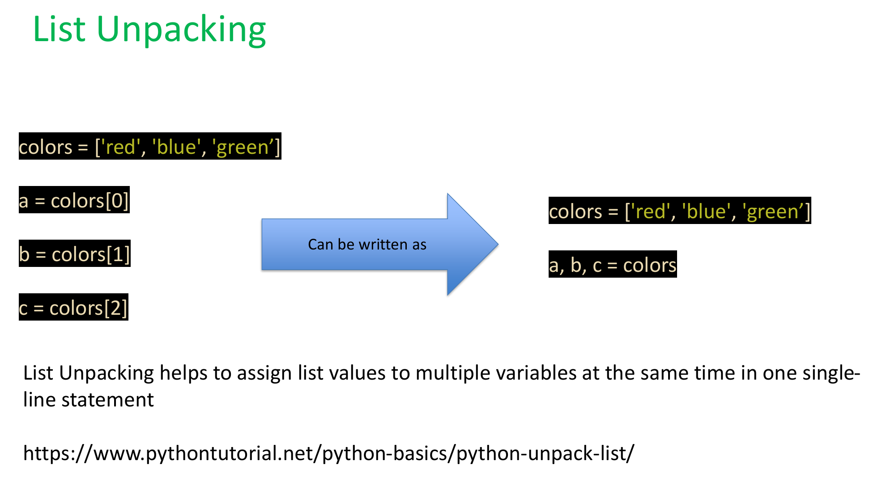

### The Traditional Way vs. Unpacking

**Traditional way** (multiple lines):
```python
colors = ['red', 'blue', 'green']
a = colors[0]
b = colors[1]
c = colors[2]
```

**Using unpacking** (one line!):
```python
colors = ['red', 'blue', 'green']
a, b, c = colors
```

Both do the same thing, but unpacking is much cleaner! ✨

---

### Rule #1: Counts Must Match! ⚖️

The number of variables on the left **must equal** the number of elements in the list on the right.

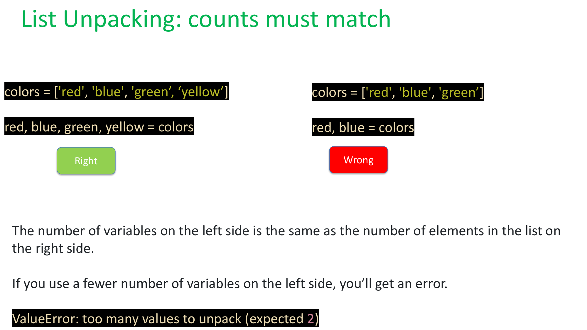

**✅ RIGHT:**
```python
colors = ['red', 'blue', 'green', 'yellow']
red, blue, green, yellow = colors
```

**❌ WRONG:**
```python
colors = ['red', 'blue', 'green']
red, blue = colors  # Error! Too many values to unpack
```

**Error message:** `ValueError: too many values to unpack (expected 2)`

---

### Using the `*` for Leftovers 🌟

What if you only want the first few items and don't care about the rest? Use the **asterisk (`*`)** to pack leftovers into a new list!

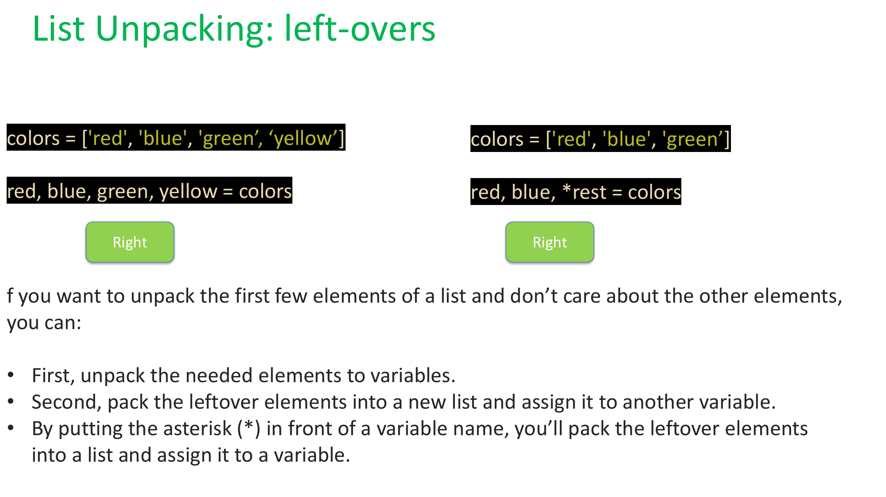

```python
colors = ['red', 'blue', 'green', 'yellow']

# Get first two colors, pack the rest into 'rest'
red, blue, *rest = colors

print(red)    # 'red'
print(blue)   # 'blue'
print(rest)   # ['green', 'yellow']
```

**How it works:**
1. First, unpack the needed elements to variables
2. Second, pack the leftover elements into a new list
3. The asterisk (`*`) tells Python to collect all remaining items

---

### Unpacking in Print Statements

You can also unpack lists when printing!

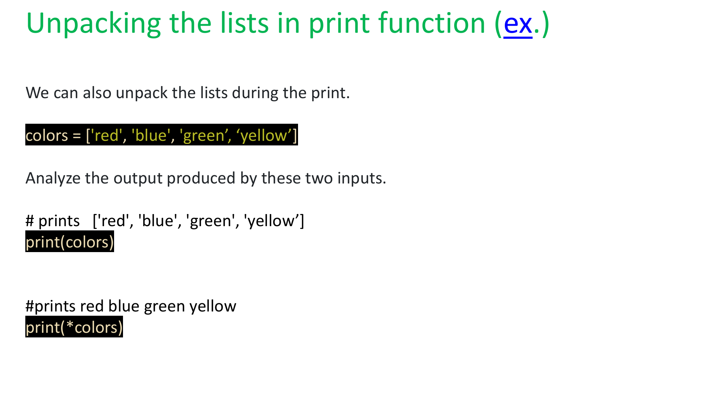

```python
colors = ['red', 'blue', 'green', 'yellow']

# Print the list normally
print(colors)
# Output: ['red', 'blue', 'green', 'yellow']

# Unpack the list when printing
print(*colors)
# Output: red blue green yellow
```

Notice the difference? The `*` removes the list brackets and commas!

---

### 📝 Unpacking Summary

1. **Short hand notation** to assign list values to variables
2. **Counts for unpacking must match** (or use `*` for leftovers)
3. **Common Error:** Too many values to unpack
4. **Common Error:** Not enough values to unpack
5. You can **prefix `*` to a variable** to assign remaining items to a sub-list

---

## Negative Indexing

Python lets you access list elements from the **end** using negative numbers! This is super useful! 🎯

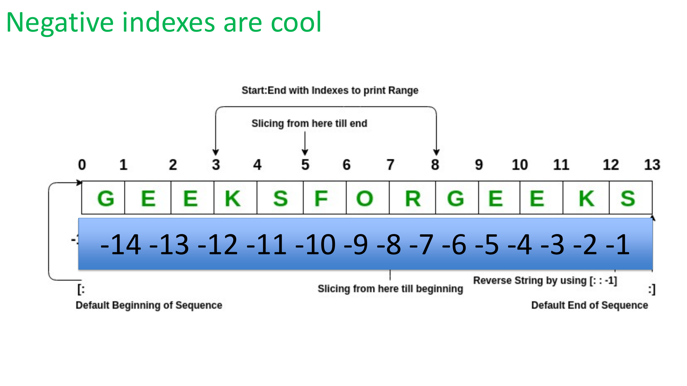

### How Negative Indexing Works:

```
Index:     0    1    2    3    4    5    6    7    8    9   10   11   12   13
        +----+----+----+----+----+----+----+----+----+----+----+----+----+----+
List:   | G  | E  | E  | K  | S  | F  | O  | R  | G  | E  | E  | K  | S  |
        +----+----+----+----+----+----+----+----+----+----+----+----+----+----+
        -14  -13  -12  -11  -10  -9   -8   -7   -6   -5   -4   -3   -2   -1
```

**Examples:**
```python
letters = ['G', 'E', 'E', 'K', 'S', 'F', 'O', 'R', 'G', 'E', 'E', 'K', 'S']

print(letters[-1])   # 'S' (last item)
print(letters[-2])   # 'K' (second to last)
print(letters[-13])  # 'E' (second item)
```

**💡 Pro Tip:** `-1` always gives you the last item!

---

## List Slicing

### What is Slicing?

Slicing lets you extract a **portion** of a list. Think of it like cutting a piece of cake! 🍰

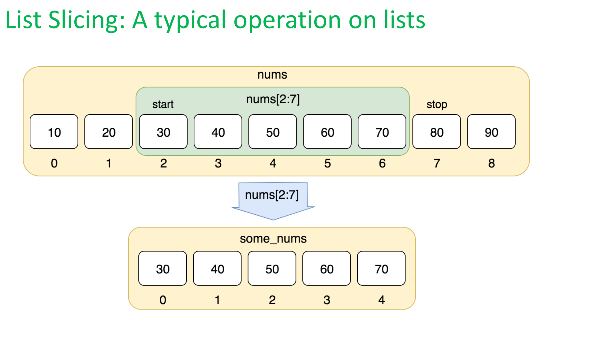

### Slicing Syntax

```python
list[start:stop:step]
```

- **start**: Where to begin (inclusive)
- **stop**: Where to end (exclusive - "up to but not including")
- **step**: How many items to skip (default is 1)

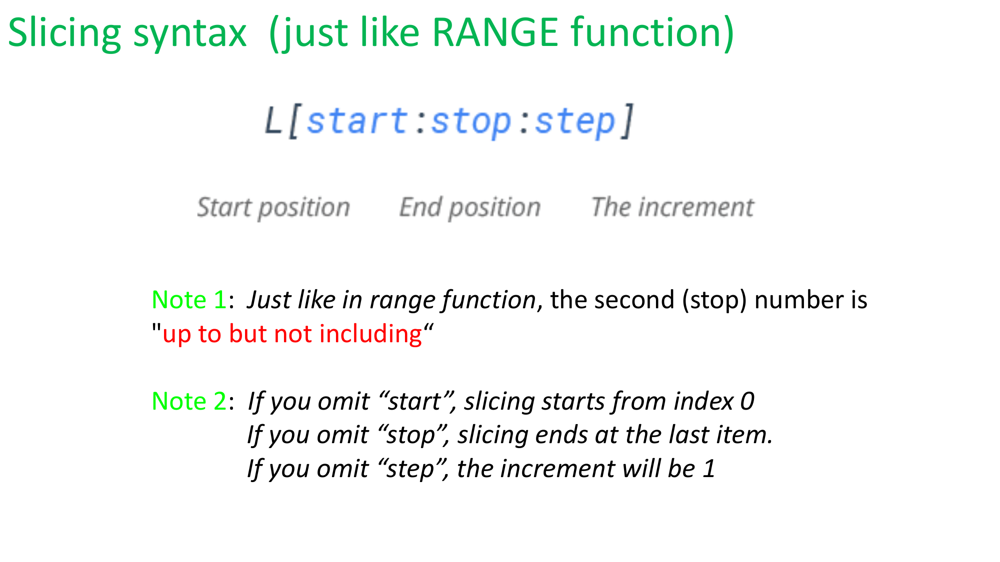

### Important Notes:

1. **Just like `range()` function:** The `stop` number is "up to but **not including**"
2. If you omit `start`, slicing starts from index 0
3. If you omit `stop`, slicing goes to the end
4. If you omit `step`, the increment will be 1

---

### Basic Slicing Examples

```python
t = [9, 41, 12, 3, 74, 15]

# Get items from index 1 to 3 (not including 3)
print(t[1:3])   # [41, 12]

# Get first 4 items
print(t[:4])    # [9, 41, 12, 3]

# Get from index 3 to end
print(t[3:])    # [3, 74, 15]

# Get entire list (makes a copy!)
print(t[:])     # [9, 41, 12, 3, 74, 15]
```

---

### Strings Can Be Sliced Too! 📝

Remember: Strings are like lists of characters!

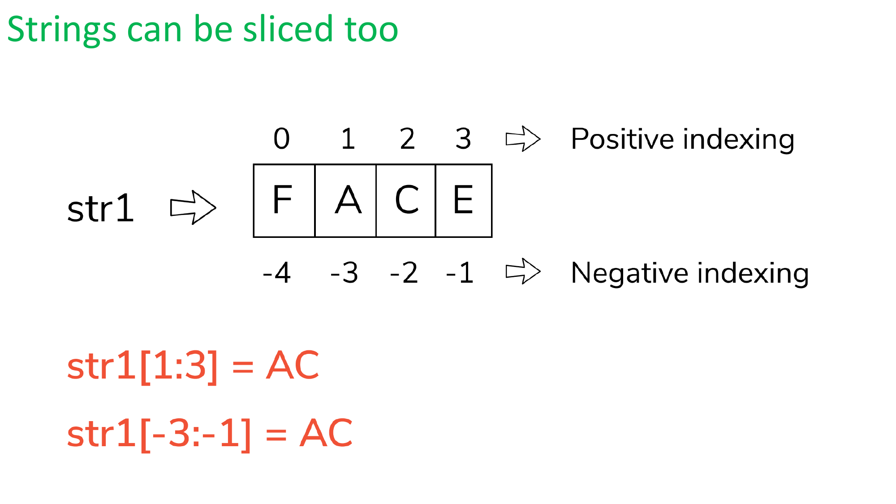

```python
str1 = "FACE"

# Positive indexing:  0  1  2  3
# Negative indexing: -4 -3 -2 -1

# Get characters from index 1 to 3 (not including 3)
print(str1[1:3])    # "AC"

# Using negative indexing
print(str1[-3:-1])  # "AC"
```

---

## Common Slicing Patterns

### 🔄 Reversing a List

Use the step of `-1` to reverse any list!

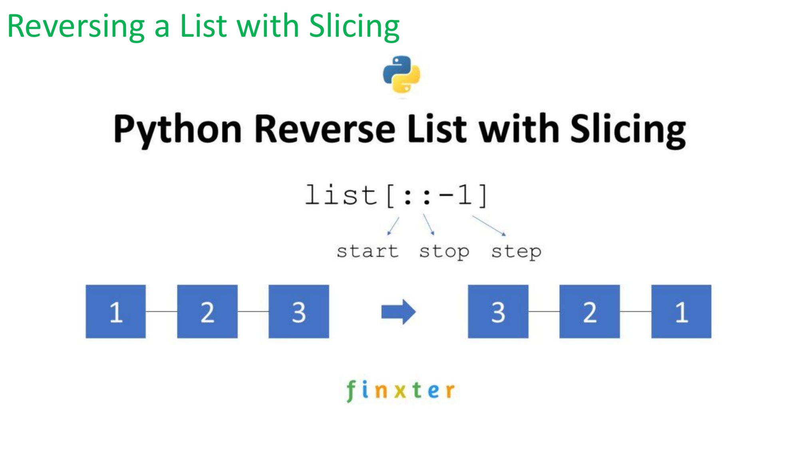

```python
numbers = [1, 2, 3, 4, 5]

# Reverse the list
reversed_nums = numbers[::-1]
print(reversed_nums)  # [5, 4, 3, 2, 1]
```

**How it works:**
- `[::]` means start to end
- `[::-1]` means start to end, but step backwards by 1

---

### ✂️ Removing Last Item


```python
list_1 = [1, 2, 3]

# Remove last item
list_1 = list_1[:len(list_1)-1]
print(list_1)  # [1, 2]

# Shorter way using negative indexing
list_1 = list_1[:-1]
print(list_1)  # [1, 2]
```

---

### ✂️ Removing First Item

```python
list_1 = [1, 2, 3, 4, 5]

# Remove first item
list_3 = list_1[1:]
print(list_3)  # [2, 3, 4, 5]
```

---

### 🎯 Getting Every Other Item

```python
numbers = [0, 1, 2, 3, 4, 5, 6, 7, 8, 9]

# Get every other item
every_other = numbers[::2]
print(every_other)  # [0, 2, 4, 6, 8]

# Get every other item starting from index 1
every_other = numbers[1::2]
print(every_other)  # [1, 3, 5, 7, 9]
```

---

## Practice Problems

### WWPD (What Would Python Display?)

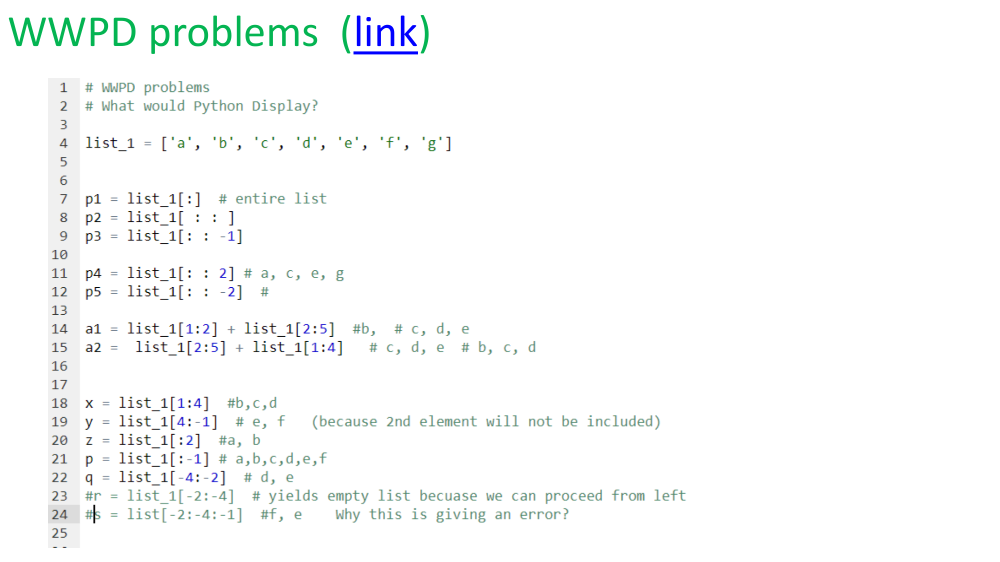

Try to figure out what each line displays **before** running the code:

```python
list_1 = ['a', 'b', 'c', 'd', 'e', 'f', 'g']

# Try to predict the output!
p1 = list_1[:]         # entire list
p2 = list_1[::1]       # same as above
p3 = list_1[::-1]      # reversed

p4 = list_1[::2]       # a, c, e, g
p5 = list_1[::-2]      # g, e, c, a

a1 = list_1[1:2] + list_1[2:5]   # b + c, d, e
a2 = list_1[2:5] + list_1[1:4]   # c, d, e + b, c, d

x = list_1[1:4]        # b, c, d
y = list_1[4:-1]       # e, f
z = list_1[:2]         # a, b
p = list_1[:-1]        # a, b, c, d, e, f
q = list_1[-4:-2]      # d, e
```

---

### 🏆 Challenge: List Operations

Try this HackerRank problem to practice list methods:
[Python Lists Problem](https://www.hackerrank.com/challenges/python-lists/problem?isFullScreen=true)

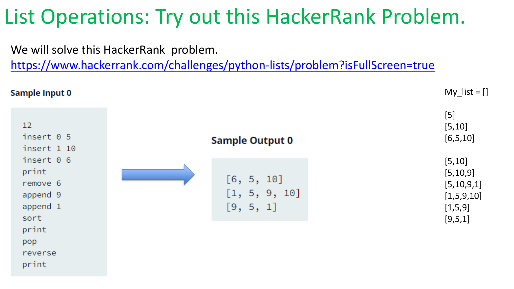

**Trace through the operations:**
```
My_list = []
insert 0 5     → [5]
insert 1 10    → [5, 10]
insert 0 6     → [6, 5, 10]
print          → [6, 5, 10]
remove 6       → [5, 10]
append 9       → [5, 10, 9]
append 1       → [5, 10, 9, 1]
sort           → [1, 5, 9, 10]
print          → [1, 5, 9, 10]
pop            → [1, 5, 9]
reverse        → [9, 5, 1]
print          → [9, 5, 1]
```

---

## 🎯 Key Takeaways

### List Unpacking:
- Quick way to assign multiple variables at once
- Number of variables must match number of list items
- Use `*` to capture "leftovers"

### List Slicing:
- Extract portions of a list with `[start:stop:step]`
- Stop index is "up to but not including"
- Negative indices count from the end
- `[::-1]` reverses a list
- Works on strings too!

### Common Patterns:
- `list[:-1]` removes last item
- `list[1:]` removes first item
- `list[::2]` gets every other item
- `list[::-1]` reverses the list

---

## 💪 Practice Makes Perfect!

The best way to learn is by doing. Try:

1. Creating your own lists and unpacking them
2. Slicing lists in different ways
3. Solving the HackerRank problem
4. Experimenting with negative indexing
5. Combining unpacking and slicing!

**Remember:** Python is all about making your code cleaner and more efficient! 🐍✨

---

## Additional Resources

- [Python Lists Tutorial - W3Schools](https://www.w3schools.com/python/python_lists.asp)
- [Think Python - Lists](https://openbookproject.net/thinkcs/python/english3e/lists.html)
- [Python List Methods](http://www.python-ds.com/python-3-list-methods)
- [Python Built-in Functions](https://docs.python.org/3/library/functions.html)
- [Python List Unpacking](https://www.pythontutorial.net/python-basics/python-unpack-list/)
