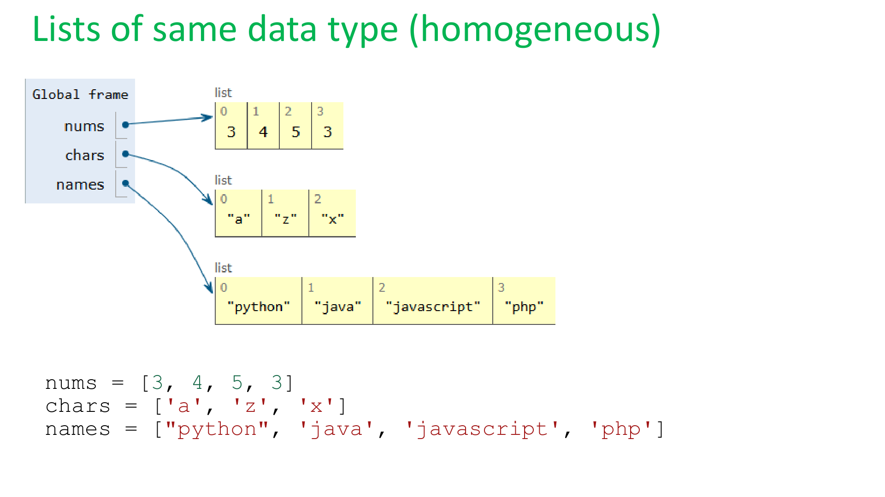
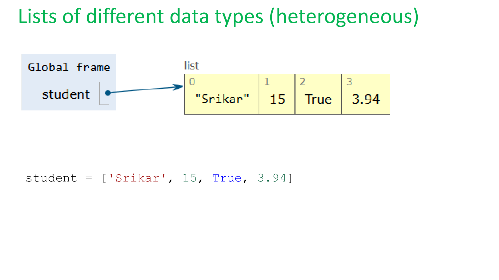
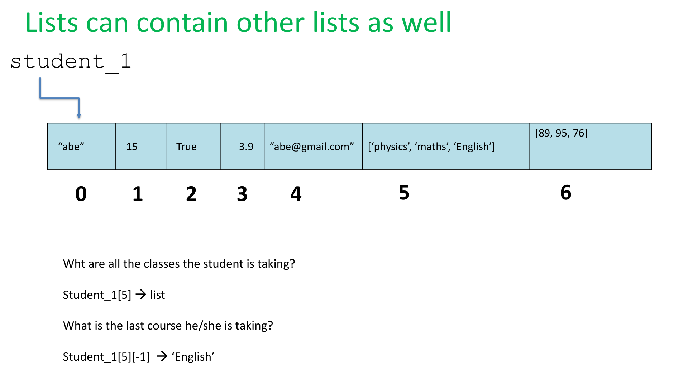
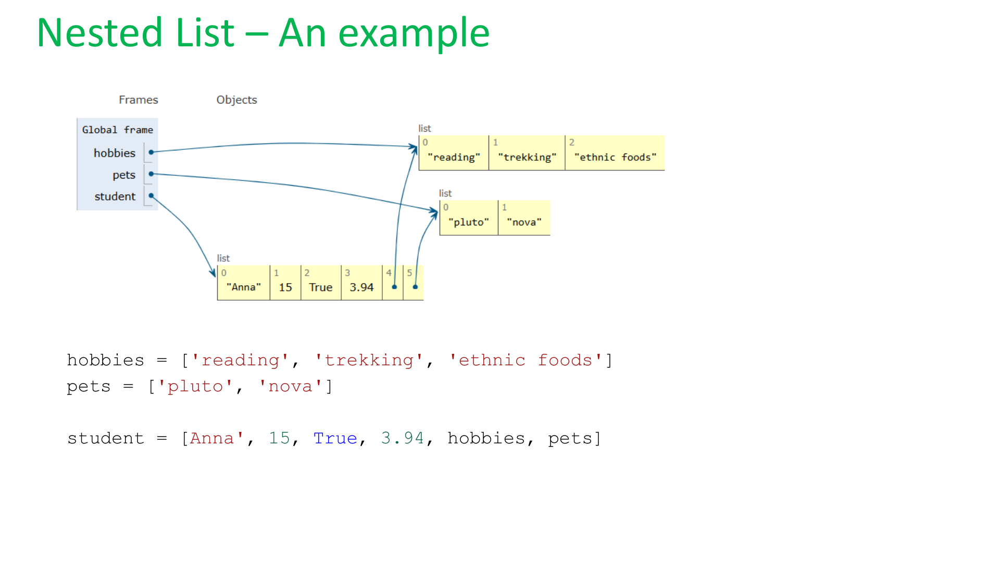
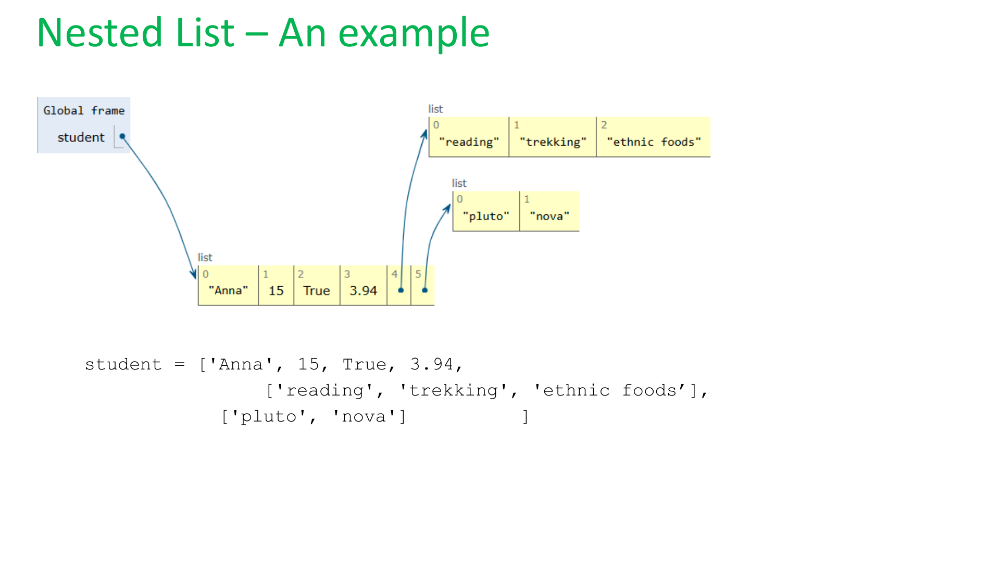
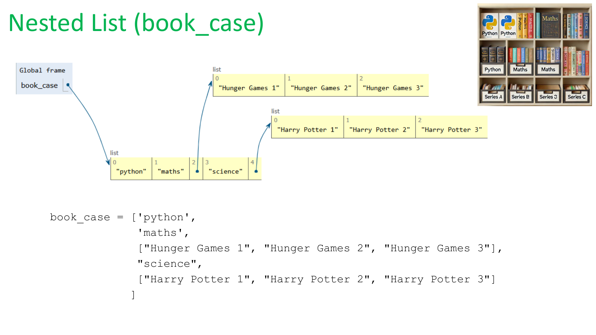
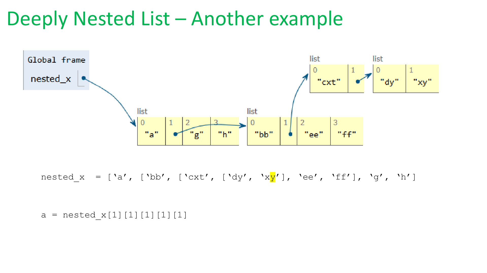
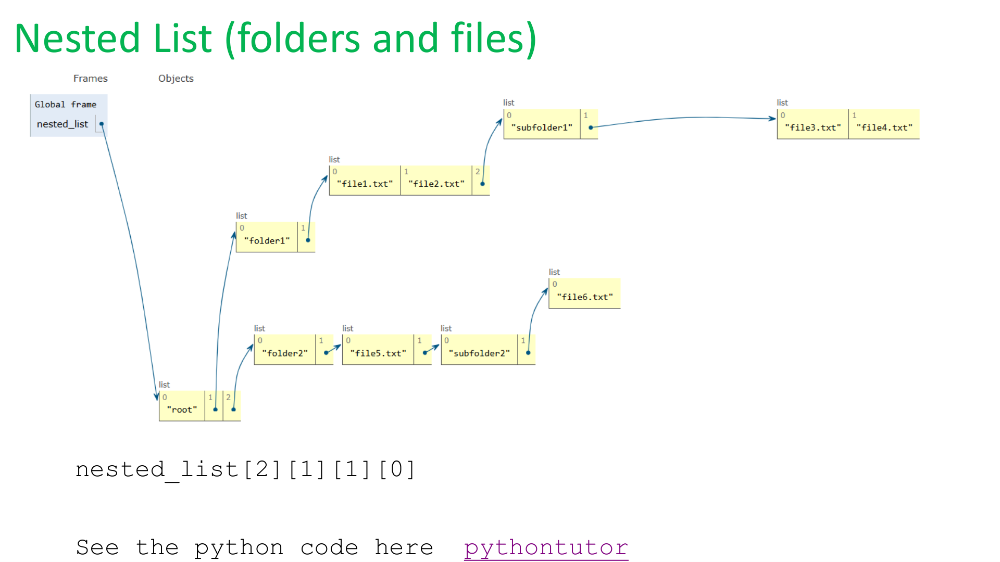

# 🐍 Python Lists: Mixed Lists & Nested Lists
**Python 101 | Chapter 7.6 – Lists and Tuples**

---

## 📋 Quick Recap

Before we dive in, here's what we already know about lists:

| Feature | Description |
|---|---|
| ✅ Ordered | Items stay in the order you put them |
| ✅ Indexed | Every item has a position number (starting at 0) |
| ✅ Changeable | You can add, remove, or update items |
| ✅ Allows Duplicates | The same value can appear more than once |
| ✅ Uses `[ ]` | Square brackets hold the list |

---

## 🎯 Today's Topics

1. 🎨 **Mixed Lists** – Lists with different data types
2. 📦 **Nested Lists** – Lists inside lists

---

## 🎨 Part 1: Mixed Lists (Heterogeneous Lists)

### Same Type vs. Different Types

So far, we've mostly used lists where **all items are the same type** — all numbers, or all strings. These are called **homogeneous** lists.

```python
nums  = [3, 4, 5, 3]           # all integers
chars = ['a', 'z', 'x']        # all characters
names = ["python", 'java', 'javascript', 'php']  # all strings
```



But Python lets you mix **any types together** in the same list! These are called **heterogeneous** (or **mixed**) lists.

```python
student = ['Srikar', 15, True, 3.94]
#           string   int  bool  float
```



> 💡 **Think of it like a backpack** — your backpack can hold a book (string), a pencil count (int), whether you have homework (bool), and your GPA (float) all at the same time!

### 🔑 Key Idea

A **mixed list** (heterogeneous list) is a list that can hold:
- 🔢 Integers (`int`)
- 💧 Decimals (`float`)
- 📝 Text (`str`)
- ✅ True/False (`bool`)
- ...and even **other lists**!

---

## 📦 Part 2: Nested Lists

### Lists Can Contain Other Lists!

A **nested list** is a list that has one or more lists *inside* it as elements. Think of it like a **folder that contains sub-folders**!

Here's a student record that includes a list of courses and a list of grades:

```python
student_1 = ["abe", 15, True, 3.9, "abe@gmail.com",
             ['physics', 'maths', 'English'],
             [89, 95, 76]
            ]
#  Index:    0    1    2    3       4                5                        6
```



### 🔍 Accessing Items in a Nested List

To access an item **inside** a nested list, you use **two sets of square brackets**:
- First `[i]` → gets the inner list
- Second `[j]` → gets the item inside that inner list

```python
# What are all the courses the student is taking?
student_1[5]          # → ['physics', 'maths', 'English']

# What is the LAST course?
student_1[5][-1]      # → 'English'

# What is the first grade?
student_1[6][0]       # → 89
```

> 💡 **Remember:** `-1` is a shortcut for the *last* item in a list!

---

### 📖 Nested List Example: Student Hobbies & Pets

You can build a nested list by creating the inner lists first, then referencing them:

```python
hobbies = ['reading', 'trekking', 'ethnic foods']
pets    = ['pluto', 'nova']

student = ['Anna', 15, True, 3.94, hobbies, pets]
```



Or you can write it all inline — same result!

```python
student = ['Anna', 15, True, 3.94,
           ['reading', 'trekking', 'ethnic foods'],
           ['pluto', 'nova']
          ]
```



```python
# Access Anna's second hobby
student[4][1]    # → 'trekking'

# Access Anna's first pet
student[5][0]    # → 'pluto'
```

---

### 📚 Nested List Example: Bookcase

Imagine a bookcase where some shelves have individual books, and others hold a whole series:

```python
book_case = ['python',
             'maths',
             ["Hunger Games 1", "Hunger Games 2", "Hunger Games 3"],
             "science",
             ["Harry Potter 1", "Harry Potter 2", "Harry Potter 3"]
            ]
```



```python
# Get the full Hunger Games series
book_case[2]        # → ["Hunger Games 1", "Hunger Games 2", "Hunger Games 3"]

# Get just "Hunger Games 2"
book_case[2][1]     # → "Hunger Games 2"

# Get "Harry Potter 3" (last in the series)
book_case[4][-1]    # → "Harry Potter 3"
```

---

### 🕳️ Deeply Nested Lists

Lists can be nested many levels deep! Each extra `[index]` digs one level deeper:

```python
nested_x = ['a', ['bb', ['cxt', ['dy', 'xy'], 'ee', 'ff'], 'g', 'h']]
```



```python
a = nested_x[1][1][1][1]   # → 'xy'
```

> 🧅 **Think of it like an onion** — each `[index]` peels off one layer!

---

### 🗂️ Real-World Example: Folders and Files

File systems on your computer use a structure *just like* nested lists!

```python
nested_list = [
    "root",
    ["folder1", ["file1.txt", "file2.txt", ["subfolder1", ["file3.txt", "file4.txt"]]]],
    ["folder2", ["file5.txt", ["subfolder2", ["file6.txt"]]]]
]
```



```python
# Access "subfolder2"
nested_list[2][1][1][0]    # → "subfolder2"
```

---

## 🧠 Summary

| Concept | What It Is | Example |
|---|---|---|
| **Mixed List** | A list with different data types | `['Anna', 15, True, 3.94]` |
| **Nested List** | A list containing other lists | `['Anna', 15, ['math', 'PE']]` |

### Key Rules to Remember 🔑

- Use `list[i]` to get the **i-th element** of a list
- Use `list[i][j]` to get the **j-th element inside the i-th inner list**
- `-1` always refers to the **last item** in a list

---

## 🧪 Practice Problems

**Try these in Google Colab! 🚀**

### Problem 1: Mixed List
```python
my_info = ['YourName', 14, True, 3.5, 'your_email@example.com']

# 1. Print your name from the list
# 2. Print your age
# 3. Print whether you like Python (True/False)
```

### Problem 2: Nested List
```python
classroom = [
    ['Alice', 90, 85, 92],
    ['Bob',   78, 88, 70],
    ['Carol', 95, 91, 98]
]

# 1. Print Bob's second score
# 2. Print Carol's last score
# 3. Print all of Alice's scores
```

### Problem 3: Build Your Own Nested List
```python
# Create a nested list for yourself with:
# - Your name (string)
# - Your age (int)
# - Whether you like coding (bool)
# - A list of your 3 favorite hobbies
# - A list of your 2 favorite foods

# Then access and print each piece of information!
```

---

*Python 101  | Learn and Help | www.learnandhelp.com*
