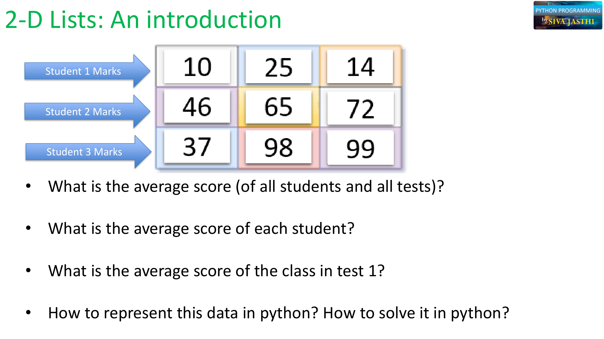
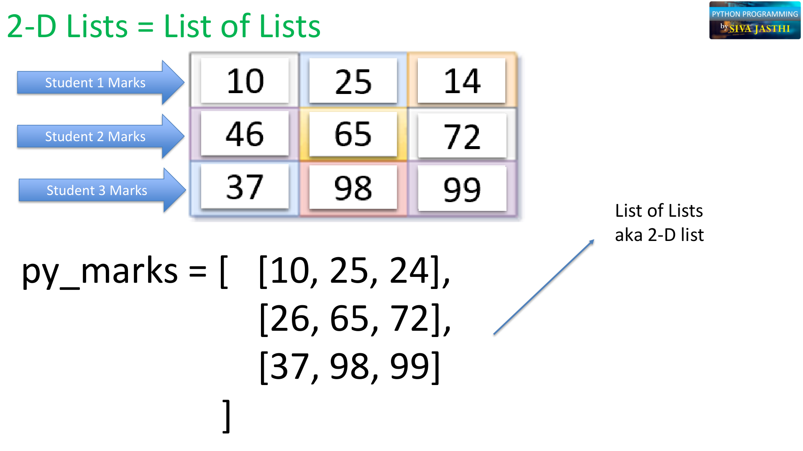
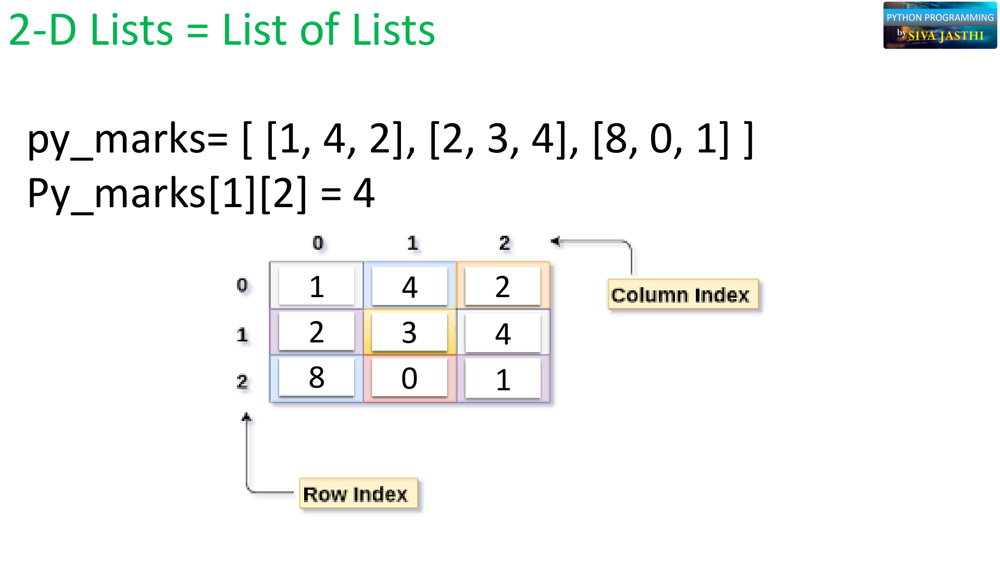
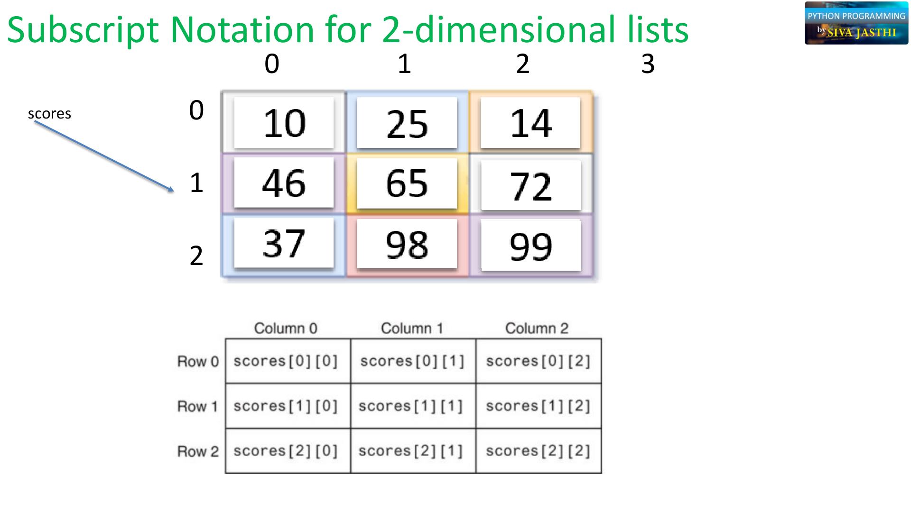
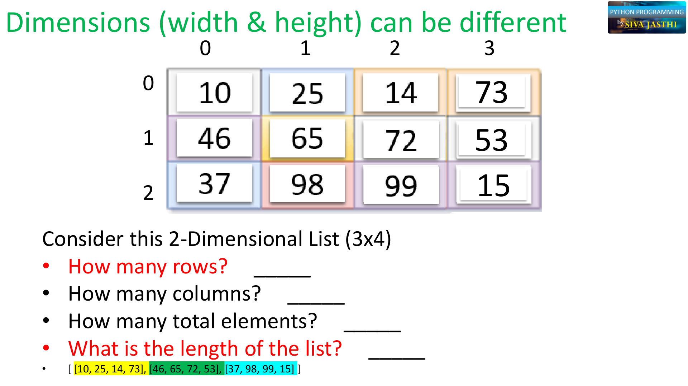
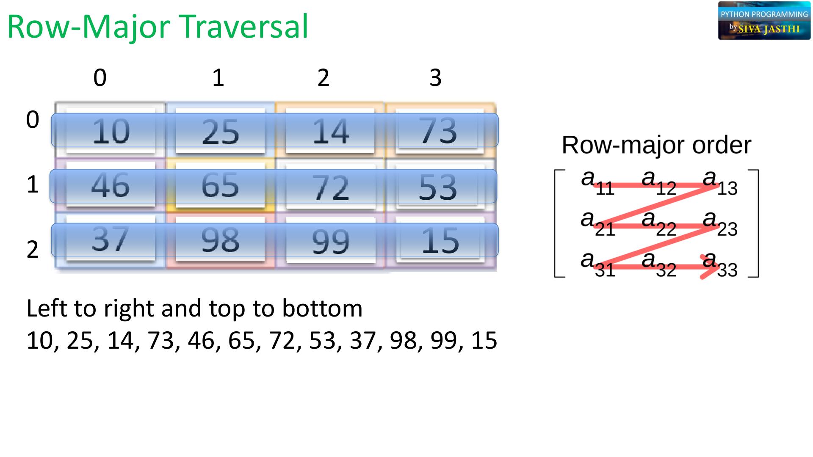
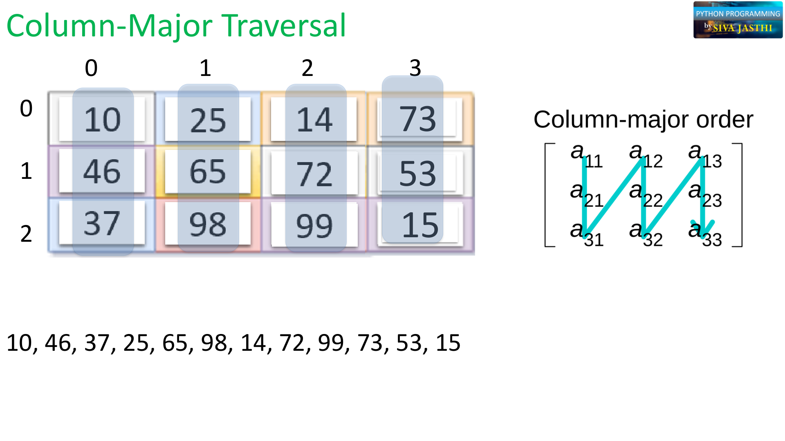
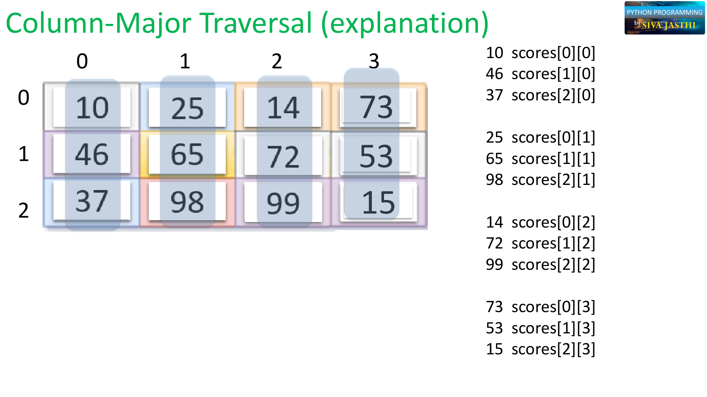

# 🐍 Python Lists: Two-Dimensional (2D) Lists
**Python 101 | Chapter 7.7 – Lists and Tuples**

---

## 📋 Quick Recap

In our last lesson we learned:
- **Mixed Lists** → a list holding different data types (`str`, `int`, `bool`, `float`)
- **Nested Lists** → a list that contains other lists inside it

Today we take nested lists one step further with **2D Lists**!

---

## 🎯 Today's Topics

1. 📊 **Introduction** – What problem do 2D lists solve?
2. 🔢 **2D Lists** – How to create and access them
3. 🔴 **Row-Major Traversal** – Going through a 2D list row by row
4. 🔵 **Column-Major Traversal** – Going through a 2D list column by column

---

## 📊 Part 1: Introduction — Why Do We Need 2D Lists?

Imagine you have test scores for **3 students** across **3 tests**:

| | Test 1 | Test 2 | Test 3 |
|---|---|---|---|
| **Student 1** | 10 | 25 | 14 |
| **Student 2** | 46 | 65 | 72 |
| **Student 3** | 37 | 98 | 99 |



With this data, you might want to ask:
- 🤔 What is the **average score** of all students across all tests?
- 🤔 What is the **average score of each student**?
- 🤔 What is the **class average for Test 1**?

A 2D list is the perfect way to store and work with this kind of grid data in Python!

---

## 🔢 Part 2: 2D Lists — A List of Lists

A **2D list** is a nested list where every inner list has the **same number of elements**, forming a neat grid (like a table or spreadsheet).

```python
py_marks = [
    [10, 25, 14],   # Student 1's scores  ← Row 0
    [46, 65, 72],   # Student 2's scores  ← Row 1
    [37, 98, 99]    # Student 3's scores  ← Row 2
]
```



You can also write it all on one line (useful for small lists):

```python
py_marks = [ [10, 25, 14], [46, 65, 72], [37, 98, 99] ]
```

---

### 🗺️ Row Index and Column Index

A 2D list uses **two indexes** — like a seat in a movie theater:
- First index → **Row** (which inner list?)
- Second index → **Column** (which item in that inner list?)



```python
scores = [ [10, 25, 14],
           [46, 65, 72],
           [37, 98, 99] ]

#           Col0  Col1  Col2
# Row 0  →   10    25    14
# Row 1  →   46    65    72
# Row 2  →   37    98    99
```

### 📋 Subscript Notation Table



| | Column 0 | Column 1 | Column 2 |
|---|---|---|---|
| **Row 0** | `scores[0][0]` → 10 | `scores[0][1]` → 25 | `scores[0][2]` → 14 |
| **Row 1** | `scores[1][0]` → 46 | `scores[1][1]` → 65 | `scores[1][2]` → 72 |
| **Row 2** | `scores[2][0]` → 37 | `scores[2][1]` → 98 | `scores[2][2]` → 99 |

```python
# Try these out!
scores[0][0]   # → 10   (Row 0, Column 0)
scores[1][2]   # → 72   (Row 1, Column 2)
scores[2][1]   # → 98   (Row 2, Column 1)
```

> 💡 **Movie theater analogy:** Think of it as "Row 1, Seat 2" — row index always comes first, then column index!

---

### 📐 Dimensions Don't Have to Be Square

Rows and columns can have **different sizes**! For example, here's a 3×4 grid (3 rows, 4 columns):

```python
scores = [
    [10, 25, 14, 73],   # Row 0 — 4 items
    [46, 65, 72, 53],   # Row 1 — 4 items
    [37, 98, 99, 15]    # Row 2 — 4 items
]
```



```python
len(scores)       # → 3  (number of rows = length of the outer list)
len(scores[0])    # → 4  (number of columns = length of one inner list)
# Total elements = 3 rows × 4 columns = 12
```

---

## 🔴 Part 3: Row-Major Traversal

**Row-major** means we go through the list **left to right, then top to bottom** — row by row.

```
10, 25, 14, 73  →  46, 65, 72, 53  →  37, 98, 99, 15
```



```python
scores = [ [10, 25, 14, 73], [46, 65, 72, 53], [37, 98, 99, 15] ]

# Row-major traversal using nested for loops
for row in scores:
    for item in row:
        print(item, end=", ")

# Output: 10, 25, 14, 73, 46, 65, 72, 53, 37, 98, 99, 15,
```

> 💡 **Think of it like reading a book** — you read left to right across each line, then move to the next line!

---

## 🔵 Part 4: Column-Major Traversal

**Column-major** means we go through the list **top to bottom, then left to right** — column by column.

```
10, 46, 37  →  25, 65, 98  →  14, 72, 99  →  73, 53, 15
```



Here's how each element maps to a column:



| Order | Value | Index |
|---|---|---|
| 1st | 10 | `scores[0][0]` |
| 2nd | 46 | `scores[1][0]` |
| 3rd | 37 | `scores[2][0]` |
| 4th | 25 | `scores[0][1]` |
| 5th | 65 | `scores[1][1]` |
| ... | ... | ... |

```python
scores = [ [10, 25, 14, 73], [46, 65, 72, 53], [37, 98, 99, 15] ]

num_rows = len(scores)        # → 3
num_cols = len(scores[0])     # → 4

# Column-major traversal
for col in range(num_cols):
    for row in range(num_rows):
        print(scores[row][col], end=", ")

# Output: 10, 46, 37, 25, 65, 98, 14, 72, 99, 73, 53, 15,
```

> 💡 **Tip:** In column-major, the **column loop is on the outside** and the **row loop is on the inside** — the opposite of row-major!

---

## 🧠 Summary

| Concept | Description |
|---|---|
| **2D List** | A nested list where inner lists form a table/grid |
| **`list[row][col]`** | Access element at a specific row and column |
| **`len(list)`** | Number of rows |
| **`len(list[0])`** | Number of columns |
| **Row-Major** | Traverse left→right, top→bottom (row by row) |
| **Column-Major** | Traverse top→bottom, left→right (column by column) |

---

## 🧪 Practice Problems

**Try these in Google Colab! 🚀**

### Problem 1: Accessing 2D List Elements
```python
grid = [ [1, 4, 2],
         [2, 3, 4],
         [8, 0, 1] ]

# 1. What is grid[1][2]?
# 2. What is grid[0][0]?
# 3. What is grid[2][1]?
# 4. Which index gives you the value 8?
```

### Problem 2: Class Scores
```python
class_scores = [
    [85, 90, 78],   # Alice
    [72, 68, 95],   # Bob
    [91, 88, 84]    # Carol
]

# 1. Print Alice's second score
# 2. Print Bob's last score
# 3. Print Carol's first score
# 4. How many rows are there? (use len())
# 5. How many columns are there?
```

### Problem 3: Row-Major Traversal
```python
nums = [ [1, 2, 3],
         [4, 5, 6],
         [7, 8, 9] ]

# Write a loop to print every number row by row:
# Expected output: 1, 2, 3, 4, 5, 6, 7, 8, 9,
```

### Problem 4: Column-Major Traversal ⭐ Challenge!
```python
nums = [ [1, 2, 3],
         [4, 5, 6],
         [7, 8, 9] ]

# Write a loop to print every number column by column:
# Expected output: 1, 4, 7, 2, 5, 8, 3, 6, 9,
```

---

*Python 101 | Metropolitan State University | Learn and Help Program | www.learnandhelp.com*
