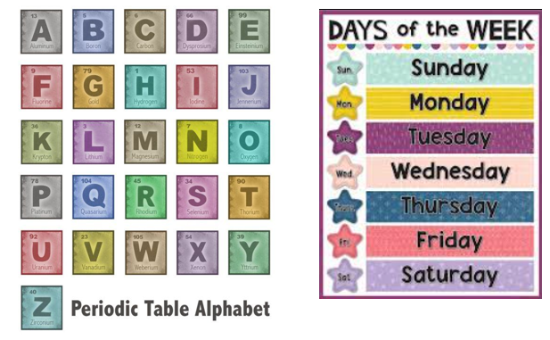
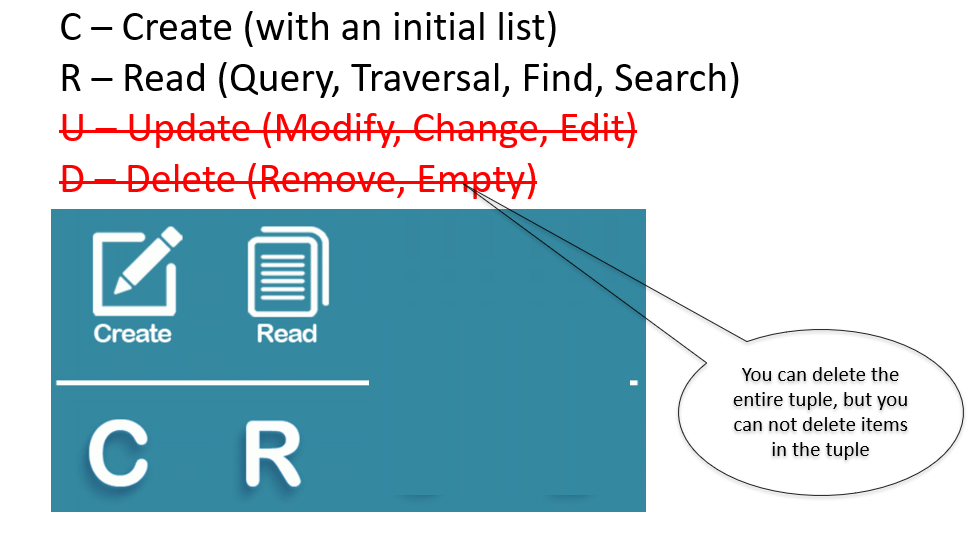
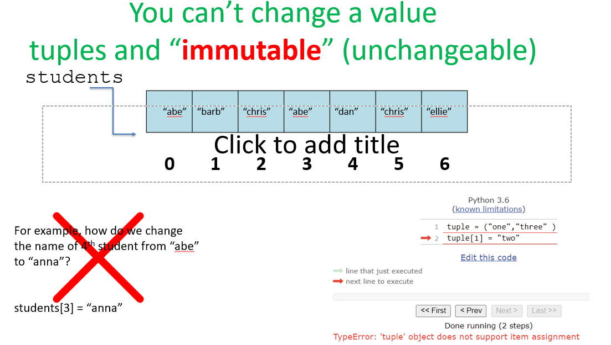
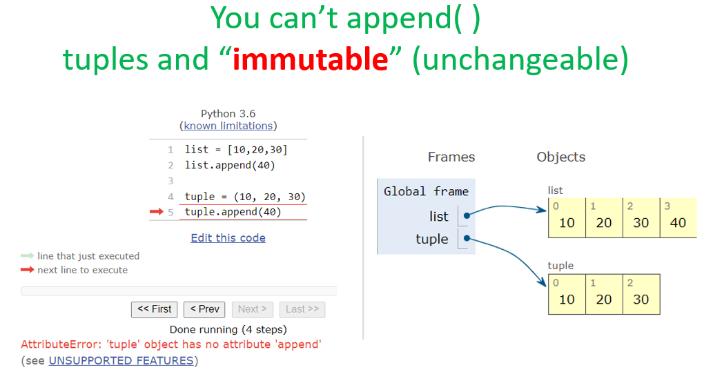

# Python Tuples 

## 1. Lists vs Tuples — What's the Difference?


| Feature              | Lists           | Tuples          |
|----------------------|-----------------|-----------------|
| Ordered              | ✅              | ✅              |
| Indexed              | ✅              | ✅              |
| Add or Update items  | ✅              | ❌              |
| Can contain duplicates | ✅            | ✅              |
| Uses                 | Square Brackets `[ ]` | Round Brackets `(,)` |

> **Key takeaway:** Tuples are like lists, but you **cannot** add or update items once they are created.

---

## 2. When Should You Use Tuples?



Use tuples when your data should **not change**. Great examples include:

- **Days of the week** — there are always 7 days and they never change
- **Elements of the Periodic Table** — fixed set of elements
- **Coordinates** (latitude, longitude)
- **RGB colour values**

```python
days_of_week = ("Sunday", "Monday", "Tuesday", "Wednesday", "Thursday", "Friday", "Saturday")

periodic_elements = ("Hydrogen", "Helium", "Lithium", "Beryllium", ...)
```

Since these values are constant and fixed, tuples are the perfect data structure to use!

---

## 3. CRUD Operations on Tuples



Tuples only support **Create** and **Read** operations:

- **C – Create** (with an initial list)
- **R – Read** (Query, Traversal, Find, Search)
- ~~**U – Update**~~ (Modify, Change, Edit) — ❌ Not allowed
- ~~**D – Delete**~~ (Remove, Empty) — ❌ You **can** delete the entire tuple, but you **cannot** delete individual items inside a tuple

---

## 4. Tuples are Immutable (Unchangeable)



Tuples are **immutable**, meaning their values **cannot be changed** after creation.

### Example — Trying to change a value:

```python
tuple = ("one", "three")
tuple[1] = "two"   # ❌ This will cause an error!
```

**Error:**
```
TypeError: 'tuple' object does not support item assignment
```

For example, given a students tuple:

```python
students = ("abe", "barb", "chris", "abe", "dan", "chris", "ellie")
#  index:     0       1        2       3      4       5        6
```

If you try to change the 4th student from `"abe"` to `"anna"`:

```python
students[3] = "anna"   # ❌ This will NOT work!
```

This will throw a `TypeError` because tuples do not support item assignment.

---

### Example: You Can't Append to a Tuple



```python
list = [10, 20, 30]
list.append(40)       # ✅ Works fine for lists

tuple = (10, 20, 30)
tuple.append(40)      # ❌ ERROR!
```

**Error:**
```
AttributeError: 'tuple' object has no attribute 'append'
```

The list grows to `[10, 20, 30, 40]`, but the tuple stays as `(10, 20, 30)` and throws an error when you try to append.

---

## 5. Tuple Methods — Only Two Are Valid

Because tuples are immutable, most list methods are **not available** for tuples. Only **two methods** are valid:

| Method      | Purpose                                          |
|-------------|--------------------------------------------------|
| `index(x)`  | Returns the index of the **first** occurrence of item `x` |
| `count(x)`  | Counts the number of times `x` appears in the tuple |

The following list methods are **crossed out** because they do **NOT** work on tuples:

| ~~Method~~         | ~~Purpose~~                                                   |
|--------------------|---------------------------------------------------------------|
| ~~`append(x)`~~    | ~~Add x to the end of the list~~                              |
| ~~`extend(list_x)`~~ | ~~Add all items from list_x at the end~~                   |
| ~~`insert(i, x)`~~ | ~~Inserts an item at a given position~~                       |
| ~~`remove(x)`~~    | ~~Removes the first item x~~                                  |
| ~~`pop()`~~        | ~~Removes the last item and returns it~~                      |
| ~~`pop([i])`~~     | ~~Removes the first item~~                                    |
| ~~`clear()`~~      | ~~Removes all elements in the list~~                          |
| ~~`sort()`~~       | ~~Sorts elements in ascending order~~                         |
| ~~`reverse()`~~    | ~~Reverses the list~~                                         |
| ~~`copy()`~~       | ~~Returns a copy of the list~~                                |

> 📖 Reference: [W3Schools — Python Tuple Methods](https://www.w3schools.com/python/python_ref_tuple.asp)


---

## 6. Everything Else Works the Same as Lists!

Even though tuples are immutable, most everyday operations you already know from lists work **exactly the same** with tuples.

### Accessing Elements (Indexing & Slicing)

```python
students = ("abe", "barb", "chris", "dan", "ellie")

print(students[0])      # abe                    — first element
print(students[-1])     # ellie                  — last element
print(students[1:3])    # ('barb', 'chris')       — slicing
```

### Iterating Over a Tuple

```python
for student in students:
    print(student)
# abe
# barb
# chris
# dan
# ellie
```

### Membership Operators (`in` / `not in`)

```python
print("barb" in students)       # True
print("anna" not in students)   # True
```

### Built-in Functions

All the built-in functions you used with lists work on tuples too:

| Function       | Example                        | Result            |
|----------------|--------------------------------|-------------------|
| `len()`        | `len(students)`                | `5`               |
| `min()`        | `min((3, 1, 4, 1, 5))`        | `1`               |
| `max()`        | `max((3, 1, 4, 1, 5))`        | `5`               |
| `sum()`        | `sum((3, 1, 4, 1, 5))`        | `14`              |
| `sorted()`     | `sorted((3, 1, 4, 1, 5))`     | `[1, 1, 3, 4, 5]` |

> 💡 Note: `sorted()` returns a **list**, not a tuple — but it still works on a tuple as input!

---

## 7. Creating a Tuple with Only One Value

This is a common trap! Students often think that wrapping a single value in round brackets makes it a tuple — but it doesn't. Python sees the brackets as just **regular parentheses** (like in maths).

```python
x = (5)
print(type(x))      # <class 'int'>   ❌ This is NOT a tuple!

y = ("hello")
print(type(y))      # <class 'str'>   ❌ This is NOT a tuple either!
```

### ✅ The Fix — Add a Trailing Comma!

To create a single-element tuple, you **must** add a comma after the value:

```python
x = (5,)
print(type(x))      # <class 'tuple'>  ✅ This IS a tuple!
print(x)            # (5,)

y = ("hello",)
print(type(y))      # <class 'tuple'>  ✅ This IS a tuple!
print(y)            # ('hello',)
```

> ⚠️ **Remember:** It's the **comma** that makes a tuple, not the brackets!

---

## 8. Recreating a Tuple

Even though you can't *modify* a tuple, you **can** assign a brand new tuple to the same variable name. This is called **recreating** the tuple — you're not changing the original tuple, you're replacing it with a whole new one.

### Assigning a New Tuple to the Same Variable

```python
x = (3, 4)
print(x)        # (3, 4)

x = (3, 4, 5)   # ✅ x now points to a completely new tuple
print(x)        # (3, 4, 5)
```

### Concatenating a Tuple with Itself Using `+`

You can use `+` to join two tuples together and assign the result back to the same variable:

```python
x = (3, 4)
x = x + x
print(x)        # (3, 4, 3, 4)
```

Or join two different tuples:

```python
a = (1, 2, 3)
b = (4, 5, 6)
c = a + b
print(c)        # (1, 2, 3, 4, 5, 6)
```

> 💡 Under the hood, Python is creating a **brand new tuple** each time and pointing the variable to it. The original tuple in memory is never changed — which is why tuples remain truly immutable!

---

## Summary

| | Lists | Tuples |
|---|---|---|
| **Syntax** | `[1, 2, 3]` | `(1, 2, 3)` |
| **Mutable?** | ✅ Yes | ❌ No (immutable) |
| **Methods available** | Many | Only `index()` and `count()` |
| **Best used for** | Data that changes | Data that stays constant |
